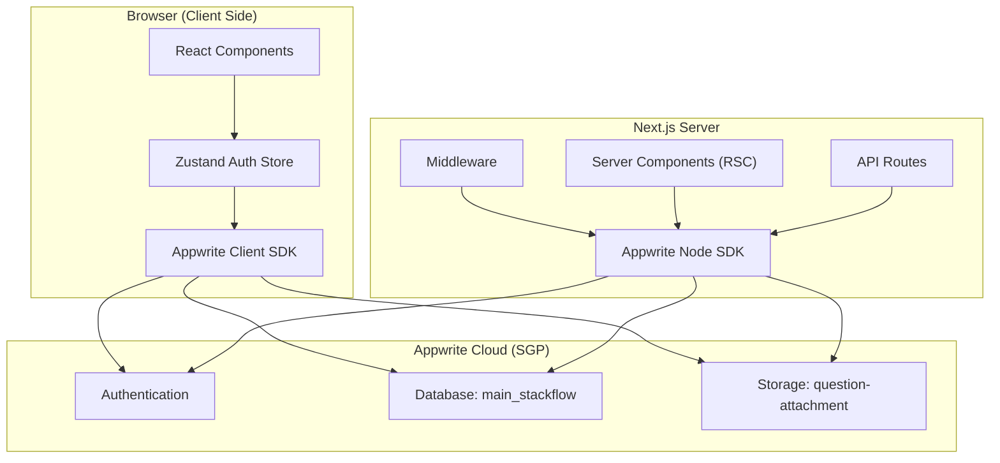

# RiverFlow — Full Stack Q&A System Documentation

## 1. Project Overview

**RiverFlow** is a full-stack Q&A web application inspired by StackOverflow. It enables users to register, log in, ask questions with Markdown formatting and image attachments, answer questions, vote, comment, and search — all within a premium dark-themed UI with particle effects and animated components.

---

## 2. Tech Stack

| Layer | Technology | Purpose |
|---|---|---|
| **Framework** | [Next.js 14](https://nextjs.org/) (App Router) | React-based full-stack framework with server-side rendering, API routes, and file-based routing |
| **Language** | TypeScript | Type-safe JavaScript for the entire codebase |
| **Styling** | [Tailwind CSS 3.4](https://tailwindcss.com/) | Utility-first CSS framework |
| **Backend / BaaS** | [Appwrite Cloud](https://appwrite.io/) (SGP region) | Backend-as-a-Service providing Database, Auth, and Storage |
| **State Management** | [Zustand 4.5](https://github.com/pmndrs/zustand) with `immer` | Lightweight global state management for authentication |
| **Animations** | [Framer Motion 11](https://www.framer.com/motion/) | Declarative animations and parallax scrolling |
| **UI Libraries** | [Aceternity UI](https://ui.aceternity.com/), [MagicUI](https://magicui.design/), [Radix UI](https://www.radix-ui.com/) | Premium animated components (cards, beams, particles, grids) |
| **Markdown** | [@uiw/react-md-editor](https://github.com/uiwjs/react-md-editor) | Rich-text Markdown editor with live preview |
| **Icons** | [Tabler Icons](https://tabler.io/icons), [Lucide React](https://lucide.dev/) | SVG icon libraries |
| **Font** | Inter (Google Fonts) | Clean, modern sans-serif typography |

### Key npm Dependencies

| Package | Version | Role |
|---|---|---|
| `next` | ^14.2.35 | App framework |
| `react` / `react-dom` | ^18 | UI library |
| `appwrite` | ^15.0.0 | Client-side Appwrite SDK |
| `node-appwrite` | ^13.0.0 | Server-side Appwrite SDK |
| `zustand` | ^4.5.2 | State management |
| `immer` | ^10.1.1 | Immutable state updates |
| `framer-motion` | ^11.2.12 | Animations |
| `@uiw/react-md-editor` | ^4.0.4 | Markdown editor |
| `clsx` / `tailwind-merge` | Latest | Conditional class merging |
| `canvas-confetti` | ^1.9.4 | Confetti celebration effects |
| `react-icon-cloud` | ^4.1.7 | 3D icon cloud animation |

---

## 3. Architecture



### Client vs. Server SDK

- **Client SDK (`appwrite`)**: Used in browser for user-facing operations (login, vote, comment, create question). Runs with user session permissions.
- **Server SDK (`node-appwrite`)**: Used in middleware and server components. Runs with an API key for admin-level access (listing users, fetching data for SSR).

---

## 4. Appwrite Configuration

### Environment Variables (`.env.local`)

| Variable | Description |
|---|---|
| `NEXT_PUBLIC_APPWRITE_HOST_URL` | Appwrite endpoint (e.g., `https://sgp.cloud.appwrite.io/v1`) |
| `NEXT_PUBLIC_APPWRITE_PROJECT_ID` | Project ID |
| `APPWRITE_API_KEY` | Server-side API key (never exposed to browser) |

### Database: `main_stackflow`

| Collection | Key Fields | Purpose |
|---|---|---|
| `questions` | `title`, `content`, `authorId`, `tags[]`, `attachmentId` | Stores all questions |
| `answers` | `content`, `questionId`, `authorId` | Stores answers linked to questions |
| `comments` | `content`, `type` (question/answer), `typeId`, `authorId` | Comments on questions or answers |
| `votes` | `type` (question/answer), `typeId`, `voteStatus` (upvoted/downvoted), `votedById` | Tracks votes on questions and answers |

### Storage Bucket: `question-attachment`

- Stores image attachments uploaded with questions
- Allowed formats: `jpg`, `png`, `gif`, `jpeg`, `webp`, `heic`
- Permissions: Public read, authenticated users can create/update/delete

---

## 5. Project File Structure & What Each File Does

### Root Configuration Files

| File | Purpose |
|---|---|
| [package.json](file:///Users/abhiram/Downloads/26-full-stack-qna-system%202/package.json) | Dependencies, scripts (`dev`, `build`, `start`, `lint`) |
| [next.config.mjs](file:///Users/abhiram/Downloads/26-full-stack-qna-system%202/next.config.mjs) | Next.js config — allows external images from `sgp.cloud.appwrite.io` |
| [tailwind.config.ts](file:///Users/abhiram/Downloads/26-full-stack-qna-system%202/tailwind.config.ts) | Tailwind CSS config with custom animations, colors, and plugins |
| [tsconfig.json](file:///Users/abhiram/Downloads/26-full-stack-qna-system%202/tsconfig.json) | TypeScript configuration with `@/` path alias mapped to `./src/` |
| [.env.local](file:///Users/abhiram/Downloads/26-full-stack-qna-system%202/.env.local) | Environment variables for Appwrite connection (not committed to git) |

---

### `src/` — Source Code

#### `src/middleware.ts`
**Next.js Middleware** — Runs on every request (except API/static/image routes). Ensures the Appwrite database and storage bucket exist before any page loads. If they don't exist, it creates them automatically.

---

### `src/app/` — Pages & Routing (Next.js App Router)

| File | Route | Description |
|---|---|---|
| [layout.tsx](file:///Users/abhiram/Downloads/26-full-stack-qna-system%202/src/app/layout.tsx) | All pages | Root layout — sets Inter font, dark mode, renders the `<Header>` navigation on every page |
| [page.tsx](file:///Users/abhiram/Downloads/26-full-stack-qna-system%202/src/app/page.tsx) | `/` | **Home page** — Renders HeroSection (parallax), LatestQuestions, and TopContributors |
| [env.ts](file:///Users/abhiram/Downloads/26-full-stack-qna-system%202/src/app/env.ts) | — | Exports environment variables in a typed object |
| [globals.css](file:///Users/abhiram/Downloads/26-full-stack-qna-system%202/src/app/globals.css) | — | Global Tailwind CSS imports |

#### `src/app/(auth)/` — Authentication Pages

| File | Route | Description |
|---|---|---|
| [layout.tsx](file:///Users/abhiram/Downloads/26-full-stack-qna-system%202/src/app/(auth)/layout.tsx) | `/login`, `/register`, etc. | Auth layout — centers content, adds background beams animation |
| [login/page.tsx](file:///Users/abhiram/Downloads/26-full-stack-qna-system%202/src/app/(auth)/login/page.tsx) | `/login` | **Login page** — Email/password login form with "Forgot Password?" link |
| [register/page.tsx](file:///Users/abhiram/Downloads/26-full-stack-qna-system%202/src/app/(auth)/register/page.tsx) | `/register` | **Registration page** — First name, last name, email, password signup form |
| [forgot-password/page.tsx](file:///Users/abhiram/Downloads/26-full-stack-qna-system%202/src/app/(auth)/forgot-password/page.tsx) | `/forgot-password` | **Forgot Password** — Enter email to receive a password reset link |
| [reset-password/page.tsx](file:///Users/abhiram/Downloads/26-full-stack-qna-system%202/src/app/(auth)/reset-password/page.tsx) | `/reset-password` | **Reset Password** — Enter new password using recovery token from email link |

#### `src/app/questions/` — Questions Pages

| File | Route | Description |
|---|---|---|
| [page.tsx](file:///Users/abhiram/Downloads/26-full-stack-qna-system%202/src/app/questions/page.tsx) | `/questions` | **Questions list** — Browse all questions with search, tag filtering, and pagination |
| [Search.tsx](file:///Users/abhiram/Downloads/26-full-stack-qna-system%202/src/app/questions/Search.tsx) | — | Search input component with URL-based query params |
| [ask/page.tsx](file:///Users/abhiram/Downloads/26-full-stack-qna-system%202/src/app/questions/ask/page.tsx) | `/questions/ask` | **Ask Question page** — Wraps the `QuestionForm` component |
| [[quesId]/[quesName]/page.tsx](file:///Users/abhiram/Downloads/26-full-stack-qna-system%202/src/app/questions/%5BquesId%5D/%5BquesName%5D/page.tsx) | `/questions/:id/:slug` | **Question detail page** — Shows full question, votes, comments, answers, author info |
| [DeleteQuestion.tsx](file:///Users/abhiram/Downloads/26-full-stack-qna-system%202/src/app/questions/%5BquesId%5D/%5BquesName%5D/DeleteQuestion.tsx) | — | Delete button (only visible to the question author) |
| [EditQuestion.tsx](file:///Users/abhiram/Downloads/26-full-stack-qna-system%202/src/app/questions/%5BquesId%5D/%5BquesName%5D/EditQuestion.tsx) | — | Edit button (only visible to the question author) |
| [edit/EditQues.tsx](file:///Users/abhiram/Downloads/26-full-stack-qna-system%202/src/app/questions/%5BquesId%5D/%5BquesName%5D/edit/EditQues.tsx) | `/questions/:id/:slug/edit` | **Edit question page** — Pre-fills the `QuestionForm` with existing question data |

#### `src/app/users/` — User Profile Pages

| Route | Description |
|---|---|
| `/users/:userId/:slug` | User profile layout with tabs |
| `/users/:userId/:slug/` | User's questions tab |
| `/users/:userId/:slug/answers` | User's answers tab |
| `/users/:userId/:slug/votes` | User's votes tab |

#### `src/app/api/` — API Routes

| Route | Description |
|---|---|
| `/api/answer` | Server-side API for creating answers (updates user reputation) |
| `/api/vote` | Server-side API for handling votes (updates user reputation) |

#### `src/app/components/` — Home Page Components

| File | Description |
|---|---|
| [Header.tsx](file:///Users/abhiram/Downloads/26-full-stack-qna-system%202/src/app/components/Header.tsx) | **Floating navigation bar** — Renders the top navbar with Home, Questions, Profile, Login/Logout links |
| [Footer.tsx](file:///Users/abhiram/Downloads/26-full-stack-qna-system%202/src/app/components/Footer.tsx) | Page footer with social links |
| [HeroSection.tsx](file:///Users/abhiram/Downloads/26-full-stack-qna-system%202/src/app/components/HeroSection.tsx) | **Hero parallax** — Fetches latest 15 questions and displays their images in a 3D scrolling parallax |
| [HeroSectionHeader.tsx](file:///Users/abhiram/Downloads/26-full-stack-qna-system%202/src/app/components/HeroSectionHeader.tsx) | Hero title ("RiverFlow"), tagline, "Ask a question" button, and the 3D icon cloud |
| [LatestQuestions.tsx](file:///Users/abhiram/Downloads/26-full-stack-qna-system%202/src/app/components/LatestQuestions.tsx) | Lists the 5 most recent questions on the home page |
| [TopContributers.tsx](file:///Users/abhiram/Downloads/26-full-stack-qna-system%202/src/app/components/TopContributers.tsx) | Shows top users ranked by reputation |

---

### `src/components/` — Shared Components

| File | Description |
|---|---|
| [QuestionForm.tsx](file:///Users/abhiram/Downloads/26-full-stack-qna-system%202/src/components/QuestionForm.tsx) | **The question creation/edit form** — Title input, Markdown editor, image upload, tags with add/remove. Used by both `/questions/ask` and the edit page |
| [Answers.tsx](file:///Users/abhiram/Downloads/26-full-stack-qna-system%202/src/components/Answers.tsx) | Renders all answers for a question. Includes a Markdown editor for submitting new answers |
| [Comments.tsx](file:///Users/abhiram/Downloads/26-full-stack-qna-system%202/src/components/Comments.tsx) | Renders comments for a question or answer. Supports adding/deleting comments |
| [VoteButtons.tsx](file:///Users/abhiram/Downloads/26-full-stack-qna-system%202/src/components/VoteButtons.tsx) | Upvote/downvote UI with API calls to `/api/vote`. Shows vote count |
| [QuestionCard.tsx](file:///Users/abhiram/Downloads/26-full-stack-qna-system%202/src/components/QuestionCard.tsx) | Card component for displaying a question in list views (title, tags, author, votes, answers count) |
| [Pagination.tsx](file:///Users/abhiram/Downloads/26-full-stack-qna-system%202/src/components/Pagination.tsx) | Page navigation component for question lists |
| [RTE.tsx](file:///Users/abhiram/Downloads/26-full-stack-qna-system%202/src/components/RTE.tsx) | Markdown preview wrapper using `@uiw/react-md-editor` |

#### `src/components/ui/` — Aceternity UI Components

| File | Description |
|---|---|
| [hero-parallax.tsx](file:///Users/abhiram/Downloads/26-full-stack-qna-system%202/src/components/ui/hero-parallax.tsx) | 3D parallax scrolling hero with rotating product cards |
| [floating-navbar.tsx](file:///Users/abhiram/Downloads/26-full-stack-qna-system%202/src/components/ui/floating-navbar.tsx) | Floating navigation bar that hides/shows on scroll |
| [tracing-beam.tsx](file:///Users/abhiram/Downloads/26-full-stack-qna-system%202/src/components/ui/tracing-beam.tsx) | Animated vertical beam that follows scroll progress |
| [background-beams.tsx](file:///Users/abhiram/Downloads/26-full-stack-qna-system%202/src/components/ui/background-beams.tsx) | Animated SVG beam background used on auth pages |
| [wobble-card.tsx](file:///Users/abhiram/Downloads/26-full-stack-qna-system%202/src/components/ui/wobble-card.tsx) | Card with mouse-follow 3D tilt effect |
| [input.tsx](file:///Users/abhiram/Downloads/26-full-stack-qna-system%202/src/components/ui/input.tsx) | Styled input component with gradient focus effect |
| [label.tsx](file:///Users/abhiram/Downloads/26-full-stack-qna-system%202/src/components/ui/label.tsx) | Styled label component |

#### `src/components/magicui/` — MagicUI Components

| File | Description |
|---|---|
| particles.tsx | Floating particle animation (used as full-page background) |
| shimmer-button.tsx | Button with animated shimmer/glow effect |
| shine-border.tsx | Card border with animated shine sweep |
| shiny-button.tsx | Button with subtle shine animation |
| magic-card.tsx | Card with spotlight hover effect |
| neon-gradient-card.tsx | Card with neon glow gradient border |
| border-beam.tsx | Animated border beam effect |
| animated-grid-pattern.tsx | Animated grid background pattern |
| animated-list.tsx | List with staggered entrance animations |
| confetti.tsx | Confetti celebration effect |
| icon-cloud.tsx | 3D rotating icon cloud |
| meteors.tsx | Falling meteor animation |
| number-ticker.tsx | Animated number counter |
| retro-grid.tsx | Retro-styled grid background |

---

### `src/models/` — Appwrite Data Layer

| File | Description |
|---|---|
| [name.ts](file:///Users/abhiram/Downloads/26-full-stack-qna-system%202/src/models/name.ts) | **Constants** — Database name (`main_stackflow`), collection names, and bucket name |
| [client/config.ts](file:///Users/abhiram/Downloads/26-full-stack-qna-system%202/src/models/client/config.ts) | **Client-side Appwrite setup** — Initializes `Client`, `Databases`, `Account`, `Avatars`, `Storage` using the public SDK |
| [server/config.ts](file:///Users/abhiram/Downloads/26-full-stack-qna-system%202/src/models/server/config.ts) | **Server-side Appwrite setup** — Initializes with API key for admin access. Includes `Users` service |
| [server/dbSetup.ts](file:///Users/abhiram/Downloads/26-full-stack-qna-system%202/src/models/server/dbSetup.ts) | **Database bootstrapper** — Creates the database and all collections if they don't exist |
| [server/storageSetup.ts](file:///Users/abhiram/Downloads/26-full-stack-qna-system%202/src/models/server/storageSetup.ts) | **Storage bootstrapper** — Creates the `question-attachment` bucket with proper permissions if it doesn't exist |
| [server/question.collection.ts](file:///Users/abhiram/Downloads/26-full-stack-qna-system%202/src/models/server/question.collection.ts) | Defines and creates the `questions` collection schema with indexes |
| [server/answer.collection.ts](file:///Users/abhiram/Downloads/26-full-stack-qna-system%202/src/models/server/answer.collection.ts) | Defines and creates the `answers` collection schema |
| [server/comment.collection.ts](file:///Users/abhiram/Downloads/26-full-stack-qna-system%202/src/models/server/comment.collection.ts) | Defines and creates the `comments` collection schema |
| [server/vote.collection.js](file:///Users/abhiram/Downloads/26-full-stack-qna-system%202/src/models/server/vote.collection.js) | Defines and creates the `votes` collection schema |

---

### `src/store/` — State Management

| File | Description |
|---|---|
| [Auth.ts](file:///Users/abhiram/Downloads/26-full-stack-qna-system%202/src/store/Auth.ts) | **Zustand auth store** — Manages user session state. Functions: `login()`, `createAccount()`, `logout()`, `verifySession()`, `forgotPassword()`, `resetPassword()`. Persisted to localStorage via `zustand/middleware` |

---

### `src/utils/` — Utility Functions

| File | Description |
|---|---|
| [relativeTime.ts](file:///Users/abhiram/Downloads/26-full-stack-qna-system%202/src/utils/relativeTime.ts) | Converts dates to human-readable strings like "3 minutes ago", "2 days ago" |
| [slugify.ts](file:///Users/abhiram/Downloads/26-full-stack-qna-system%202/src/utils/slugify.ts) | Converts titles to URL-safe slugs (e.g., "My Question" → "my-question") |
| [cn.ts](file:///Users/abhiram/Downloads/26-full-stack-qna-system%202/src/utils/cn.ts) | Utility for merging Tailwind class names (re-exported from `src/lib/utils`) |

---

## 6. Key Features & How They Work

### 🔐 Authentication
- **Registration**: User signs up with name, email, password → Appwrite creates an account → Auto-login
- **Login**: Email/password → Appwrite creates a session → Stored in Zustand (persisted to localStorage)
- **Forgot Password**: Enters email → Appwrite sends recovery email → User clicks link → Redirects to `/reset-password` with `userId` and `secret` tokens → Sets new password
- **Session Verification**: On app load, Zustand calls `verifySession()` to check if the stored session is still valid

### ❓ Questions
- **Create**: Authenticated user fills in title, Markdown content, optional image, optional tags → Uploaded to Appwrite Database + Storage
- **Edit**: Author can edit their own question (pre-filled form)
- **Delete**: Author can delete their own question (with storage attachment cleanup)
- **View**: Server-side rendered with full Markdown preview, attached image, votes, comments, and all answers

### 💬 Answers & Comments
- **Answers**: Users can submit Markdown answers to any question via the answer editor at the bottom of the question page
- **Comments**: Users can add text comments to any question or answer. Authors can delete their own comments

### 🗳️ Voting
- **Upvote/Downvote**: Available on both questions and answers
- **Reputation System**: Upvoting gives the author +1 reputation, downvoting gives -1. Tracked in user preferences

### 🔍 Search
- Full-text search across question titles using URL query parameters
- Tag-based filtering from question detail pages

---

## 7. UI/UX Design Details

### Theme
- **Dark mode** enforced globally via `className="dark"` on `<html>`
- Color palette: Black background, white text, orange accents (`#f97316`)
- Gradient effects on buttons and borders

### Animated Components Used
| Effect | Component | Where Used |
|---|---|---|
| Parallax scrolling | `HeroParallax` | Home page hero |
| Floating nav | `FloatingNavbar` | Global header |
| Particle background | `Particles` | Question detail pages |
| Tracing beam | `TracingBeam` | Question detail pages |
| Background beams | `BackgroundBeams` | Auth pages |
| Shimmer button | `ShimmerButton` | "Ask a question" CTA |
| 3D icon cloud | `IconCloud` | Home page hero |
| Animated grid | `AnimatedGridPattern` | Home page sections |

---

## 8. Running the Application

```bash
# Install dependencies
npm install

# Set up environment variables
cp .env.sample .env.local
# Fill in your Appwrite endpoint, project ID, and API key

# Start development server
npm run dev
# → Opens at http://localhost:3000

# Production build
npm run build
npm start
```

### First Run
On the very first request, the **middleware** automatically:
1. Creates the `main_stackflow` database (if not exists)
2. Creates all 4 collections with proper schemas and indexes
3. Creates the `question-attachment` storage bucket

No manual Appwrite setup needed!

---

## 9. Fixes Applied During This Session

| Issue | Root Cause | Fix |
|---|---|---|
| Question form title text invisible | White text on white input background | Added `className="text-black"` to all `<Input>` components |
| Database not found error | Typo: `main-stackflow` vs actual `main_stackflow` | Corrected in `src/models/name.ts` |
| Images returning 403 | Appwrite Free tier blocks `getFilePreview` (image transformations) | Changed to `getFileView` across all components |
| Hydration mismatch error | Relative time differs between server render and client hydrate | Added `suppressHydrationWarning` to date spans |
| External images blocked by Next.js | `sgp.cloud.appwrite.io` not in allowed hosts | Added to `images.remotePatterns` in `next.config.mjs` |
| Hero images too heavily tilted | `rotateX: 15°`, `rotateZ: 20°` too aggressive | Reduced to `8°` each for a subtler effect |
